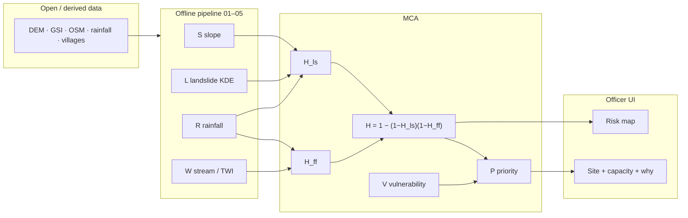

<p align="center">
  
</p>

<p align="center">
  <strong>Intelligent identification of hazard-based red zones, carrying capacity, and immediate relocation needs</strong><br/>
  Ministry of Home Affairs / NDRF · Disaster Management · Team <em>The Alchemists</em>
</p>

<p align="center">
  
  
  
  
</p>

<p align="center">
  
  
  
  
  
</p>

---

## What this is

**RedZone DSS** (pitched as *RakshaGrid*) is an **explainable GIS decision-support prototype** for **Rudraprayag, Uttarakhand**. An officer can go from a map → a vulnerable habitation → **why** it is Immediate → a **safer site** with **screening capacity** and a **runner-up**.

Intelligence is **multi-criteria analysis (MCA)** — weighted overlays, not a neural net. `ml_enabled: false`.

<table>
  <tr>
    <td width="50%">

**In scope**
- One district, two hazards (landslide + cloudburst / flash-flood)
- Derived **screening** red zones
- Vulnerability + relocation priority
- Site ranking + first-order carrying capacity
- FastAPI + React/Leaflet + Hindi/EN
- Nightly pipeline, rainfall **scenario** slider, alerts, PDF
- Static parachute if the API dies

</td>
    <td width="50%">

**Not this**
- Official NDMA / GSI hazard zonation
- Statutory or legal settlement capacity
- Live satellite inference or IMD nowcast
- All-India / second district / third hazard
- Black-box ML in the demo UI
- Cadastral, FRA, or forest-clearance logic

</td>
  </tr>
</table>

> **Derived ≠ official.** Capacity is **first-order physical screening** (80 **m²**/person after deraters), not a gazette notification. Expert-screened demo layers are labelled in `meta.json` and the UI.

---

## Hazard colours

<p align="center">
  
  
  
  
</p>

Priority classes: **Immediate** (≥ 0.75, or override) · **Short-term** · **Medium-term** · **Monitor**.

Forced **Immediate** if **≥ 40%** of habitation area is red **or** `H_hab ≥ 0.80`.

---

## How a score is born



| Model | Formula |
|:------|:--------|
| Landslide | \(H_{ls} = 0.45S + 0.40L + 0.15R\) |
| Flash-flood | \(H_{ff} = 0.50W + 0.50R\) |
| Multi-hazard | \(H = 1 - (1-H_{ls})(1-H_{ff})\) |
| Priority | \(P = 0.60\,H_{hab} + 0.40\,V\) |
| Capacity | \(A_{safe}\) (ha) → m² `/ 80` × road/water/health deraters |
| Suitability | \(U_{ij}\) = safety, distance, access, capacity fit |

Weights live in [`config/weights.yaml`](config/weights.yaml). Step-by-step with calculators: **[Formula study guide](docs/formula_guide.html)** (open the HTML in a browser).

---

## Quick start

**Need:** Python 3.11+ · Node.js 18+

<details>
<summary><strong>A. Fastest demo</strong> — precomputed GeoJSON, no GIS rebuild</summary>

```bash
cd backend
pip install -r requirements.txt
uvicorn app.main:app --reload --port 8000
```

```bash
cd frontend
npm install
npm run dev
```

Open [http://localhost:5173](http://localhost:5173).

**API down?** The UI still loads `frontend/public/data/`.

```bash
cd frontend
npm run build
npm run preview
```

Then [http://localhost:4173](http://localhost:4173).

</details>

<details>
<summary><strong>B. Full pipeline</strong> — download + score + alerts + PDF</summary>

```bash
cd scripts
pip install -r requirements.txt
python download_data.py
python 07_run_pipeline.py
```

Nightly / Task Scheduler: the same `07_run_pipeline.py` command.

- Refresh status: `GET /api/meta/refresh-status`
- Dev refresh: `POST /api/admin/refresh`

Manual GIS steps if you do not want the orchestrator:

```bash
cd scripts
python 01_preprocess.py
python 02_risk_engine.py
python 03_vuln_engine.py
python 04_relocation.py
python 05_export.py
```

</details>

<details>
<summary><strong>C. Tests & rehearsal</strong></summary>

```bash
cd scripts
python 05_export.py
python validate_demo.py
```

```bash
cd backend
pytest tests/ -v
```

```bash
python scripts/run_demo_rehearsal.py
```

Checklist: [`docs/REHEARSAL_CHECKLIST.md`](docs/REHEARSAL_CHECKLIST.md) · script: [`docs/demo_script.md`](docs/demo_script.md).

</details>

---

## Four screens

| | Page | What judges should see |
| :---: | :--- | :--- |
| 1 | **Overview** | KPIs, sources, limitations, last updated |
| 2 | **Risk map** | District, red/orange/yellow, GSI points, streams, habitations, sites |
| 3 | **Habitation** | `H`, `V`, `P`, % red, stacked “why”, Immediate override |
| 4 | **Relocation** | Ranked site, screening capacity, reasons, runner-up |

---

## Repo map

```text
redzone-dss/
├── config/          weights.yaml · paths.yaml
├── data/            raw + processed GIS (often local, not huge commits)
├── out/             precomputed GeoJSON / JSON for the demo
├── scripts/         01–09 pipeline, download, alerts, PDF, ML scaffold
├── backend/         FastAPI (read artifacts + light scenario rescore)
├── frontend/        React + Vite + Leaflet  ·  public/data/ parachute
└── docs/            spec, FAQ, demo, formula_guide.html
```

---

## Data honesty

| Layer | Typical provenance |
|:------|:-------------------|
| District, GSI, OSM | `OPEN_DATA` |
| Red zones, scores | `DERIVED` — not statutory zonation |
| Demo habitations / sites | `EXPERT_SCREENED` (25 habitations in the locked demo) |
| DEM / rainfall fallback | `DERIVED` orographic if portals fail — UI banner + `meta.json` |

If downloads fail, `download_data.py` still produces **terrain-derived** DEM and **orographic** rainfall (not a flat fake field). Never present synthetic/derived as official.

---

## Troubleshooting

| Symptom | Fix |
|:--------|:----|
| Blank map / 404 on `/data/*` | `python scripts/05_export.py` |
| API up but empty layers | Ensure `out/` exists; restart uvicorn |
| `validate_demo.py` parity fail | Re-run `05_export.py` |
| Synthetic / degraded banners | Expected when DEM or rainfall rasters are missing |
| Stale recommendations | Re-run `01`–`05` or `07_run_pipeline.py` |

---

## Docs

| Doc | Use |
|:----|:----|
| [`docs/formula_guide.html`](docs/formula_guide.html) | Formulas in plain language + calculators |
| [`docs/judge_faq.md`](docs/judge_faq.md) | Short answers for viva |
| [`docs/PS26191_SPEC.md`](docs/PS26191_SPEC.md) | Full contract |
| [`docs/FEATURE_FREEZE.md`](docs/FEATURE_FREEZE.md) | Phase 2 / 3 status |
| [`docs/demo_script.md`](docs/demo_script.md) | 5-minute narration |

<p align="center">
  <sub>Working prototype &nbsp;·&nbsp; Explainable scoring &nbsp;·&nbsp; Honest labels &nbsp;·&nbsp; Demo reliability</sub>
</p>
